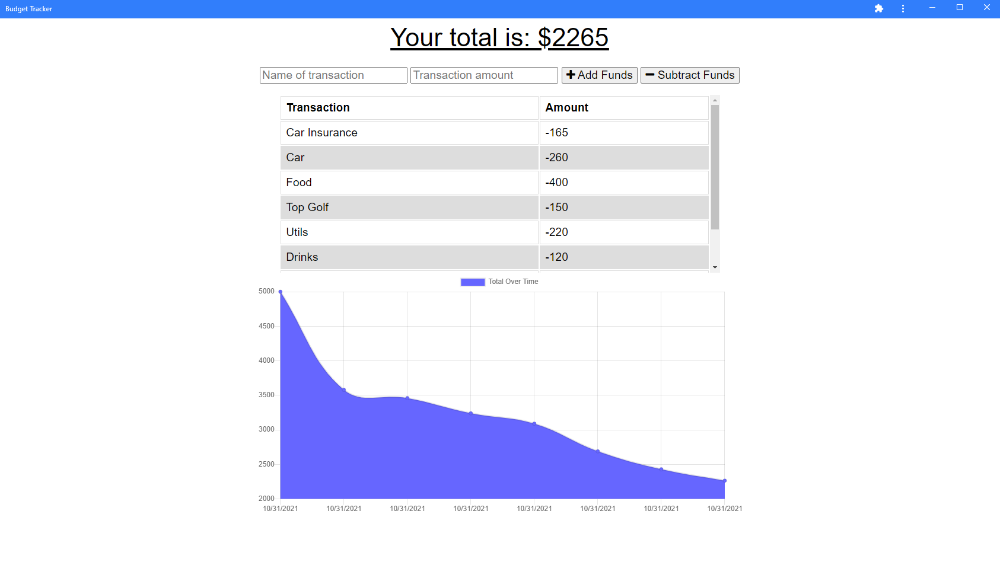

# PWA Budget Tracking Application

# Description
Application that utilizes Mobile First Development by having the ability to be installed as a PWA and has offline persistency by combining IndexedDB for storing data offline with Service Workers for storing assets offline. This application is deployed to Heroku using MongoDB Atlas which utilizes AWS servers so the data that is entered into the application while offline will be automatically uploaded to the database once an internet connection is made again however the application offers complete usability even while offline!

# Technologies Used 
- MongoDB Atlas
- Mongoose
- Express.js
- Node.js
- Service Workers
- PWA

# Usage

[PWA Budget Tracking Application](https://spooky-mausoleum-60588.herokuapp.com) is hosted on Heroku, feel free to install the app as a Progressive Web Application!

# License

> This project is using the MIT license.
